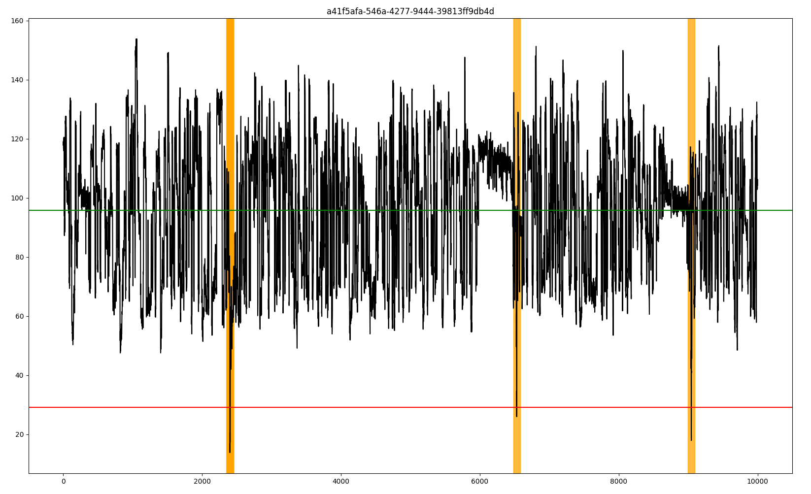

# deadcells

Detecting signals that indicate a dead sample


## setup

Using python 3.8 and up

```bash
git clone git@github.com:Psy-Fer/deadcells.git
cd deadcells

python3 -m venv ./venv
source ./venv/bin/activate

pip install --upgrade pip

pip install .

deadcells --help
```

## run

To run, point at raw data and choose values

```bash
deadcells --slow5 /path/to/file.blow5 --std_scale 3.0 --padding 50 --plot
```

```
usage: deadcells [-h] [-s SLOW5] [-p POD5] [-c STD_SCALE] [--padding PADDING] [--plot] [-V]

Detecting signals that indicate a dead sample

options:
  -h, --help            show this help message and exit
  -s SLOW5, --slow5 SLOW5
                        slow5 file for input
  -p POD5, --pod5 POD5  pod5 file for input
  -c STD_SCALE, --std_scale STD_SCALE
                        scale for std deviation
  --padding PADDING     padding around detected candidates
  --plot                live plotting
  -V, --version         Prints version

```


## output

ReadID    position below threshold
```
1ee01e42-13db-4d97-b0c3-e7d3488f7743	9374,9375,9376
1ee01e42-13db-4736-887b-cf477a15e6e2	1214,1215,1216,1217,1218,1219,1220,1221,1222,1223,1224,1225,1226
1ee01e42-13db-4af5-a719-b2aa8c68c672	
1ee01e42-13db-4431-9a26-7456806a3da0	7197,7198,7199,7200,7201,7202,7203,7204,7205,7206,7207,7208,7209,7210,7211,7212,7215
1ee01e42-13db-4c85-a132-4d17027d6da3	1704,1705,1706
c967e3ef-c23c-4e8d-951b-4dd53f5c8a13	3988,3989,3990,3991,3992,3993,3994
ed4743f6-289e-40cf-b6b7-f76a330b5f8a	3726,3727,3728,3729,3730,3731,3732
6dff8ed7-7fa5-4717-9db4-c3827bbafa1e	2460
bd0c636c-cbd2-4925-829f-32d7010d12b7	44,45,46,4775,7367
bd0c636c-cbd2-4342-9b06-e15568ccc794	9385,9387
bd0c636c-cbd2-48c6-aa8e-75ef92b6106c	807,809,810,811,812
54f4376a-0a2d-4aac-8987-1f46b97082a1	3889
a41f5afa-546a-4277-9444-39813ff9db4d	2399,2400,2401,2402,2403,2404,6530,6532,9044,9045
```


